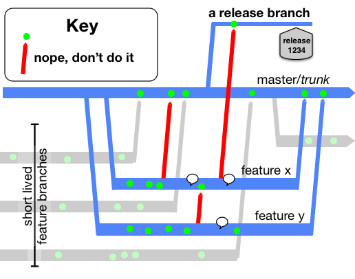

This branching model was facilitated with the advent of very lightweight branching that came with Git and Mercurial
in the mid-2000's.

Either as branching directly off master, or in a fork of the whole repository. These branches are destined to come
back as "pull requests" into the master/trunk.

With this advance, the cut-off point on team size for "direct to the trunk" lowered.
While it was up to 100 before Git's lightweight branching, it is now up to 15 people. With 16 or more, the team is more
productive with short-lived feature branches, and corresponding CI daemons verifying those in advance of
commits landing in the trunk.

One key rule is the length of life of the branch before it gets merged and deleted. Simply put, the branch
should only last a couple of days. Any longer than two 
days, and there is a risk of the branch becoming a long-lived feature branch (the antithesis of trunk-based development).

Another key rule is how many developers are allowed congregate on a short-lived feature branch. Another simple answer:
the developer count should stay at one (or two if pair-programming). These short-lived feature branches are not shared
within a team for general development activity. They may be shared for the purposes of code review, but that is entirely
different to writing production code and tests.

## Merge directionality

Short-lived feature branches are real branches and merge is a first class concept. In the run up to completing work
on the short-lived feature branch, you will need to bring it up to date with master (trunk). That is an effective
merge whichever way you do it. Look at the branch at this moment, it may appear to be much younger than it was
before that operation. The changes have to now go back to master (trunk) in another merge operation. In GitHub, for
'pull requests' (or equivalent in other platforms), the user interface may handle that last merged back for you, and even
go as far as to delete the short-lived feature branch.

To recap: merges to the short-lived feature branch are allowed to bring it closer to HEAD of master (trunk). Merges
to master (trunk) are allowed only as past of closing out the short-lived feature branch (and just before deleting) it.

## Breaking the contract

If you merged the part-complete short-lived feature branches to anywhere else, then you have broken the
contract of trunk-based development. For short-lived feature branches, these are **not** allowed:

1. intermediate merges to master (trunk)
2. merges (intermediate or not) to other people's short-lived feature branches
3. merges (intermediate or not) to any release branches (if you have them)
4. variations of #2 that are direct from/to the developers clone on their workstation

## Personal preferences

At some point, the short-lived feature branch has to be bought right up to date with master (trunk) in a merge
operation before the result being merged back to trunk (and the branch deleted). There are a number of approaches
for this, and while teams may have a policy, most leave it to personal preference for the developer.

### Git stash

Some people do `git stash` before `git pull` before `git stash pop`. There's a chance that when you `pop` your
working copy may be in a merge clash situation that has to be resolved before you progress. This way will always
result in your change being a single commit, at the HEAD of the branch (as Subversion would always do).

### Git rebase

Some people do `git rebase`. Refer to a well written Atlassian document on this  as well as one from ThoughtBot  that talks about `squash` too.  Even with this model,
you may encounter a merge clash, and have to resolve that locally before you can push the result anywhere, or do
further merges (to master hopefully).

# Alternatives to short-lived feature branches

There is a more traditional alternative for smaller teams:
[Committing straight to the trunk](/committing-straight-to-the-trunk/).
